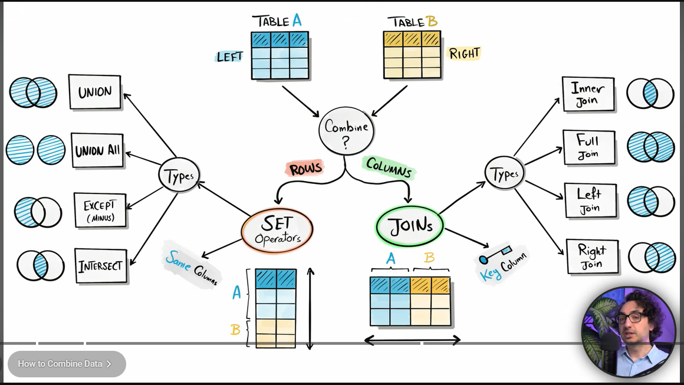

## Joins in sql 

- There can be 2 ways in which u can join tables either u wanna combine columns (joins) or u wanna combine row (set Operators)




## Joins

- lets say data is across 2 tables, u wanna query it and want data from 2 tables, so join the 2 tables based on a common column between 2 tables

- why do we even use joins ?

1) Recombine data :  customers , address, orders, reviews, etc

2) Data Enrichment (getting extra info) : customers , zip code tables (look up tables)

3) check for existence  of records from one table, whether they are present in other table or not !!


## Types of Joins :

LEFT TABLE : RIGHT TABLE

1) INNER JOIN :   middle part (matching rows from left and right table based on common column key)

```sql
Task : Get all customers along with their orders but only for customers who have placed an order 

SELECT *
from CUSTOMERS as c
JOIN
ORDERS as o
ON c.cust_id = o.cust_id;


```


