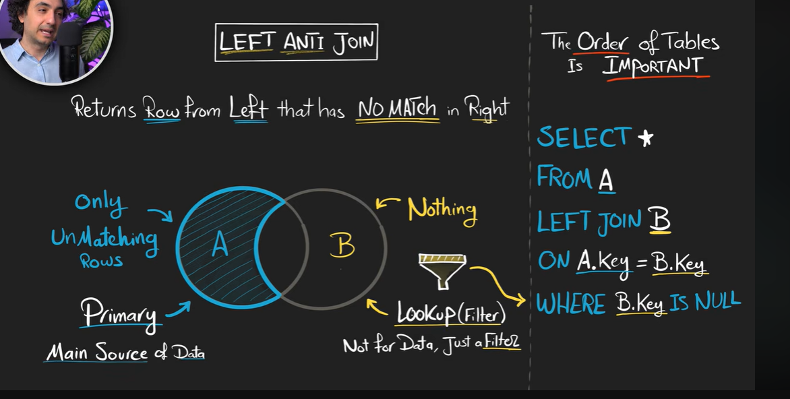
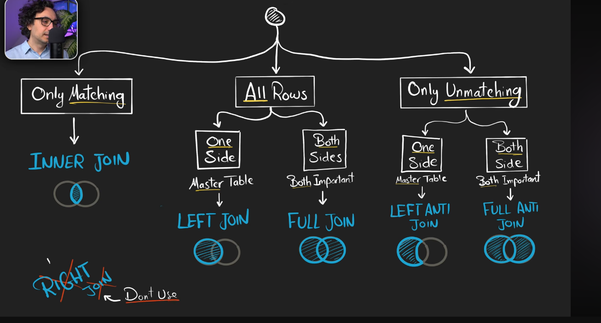
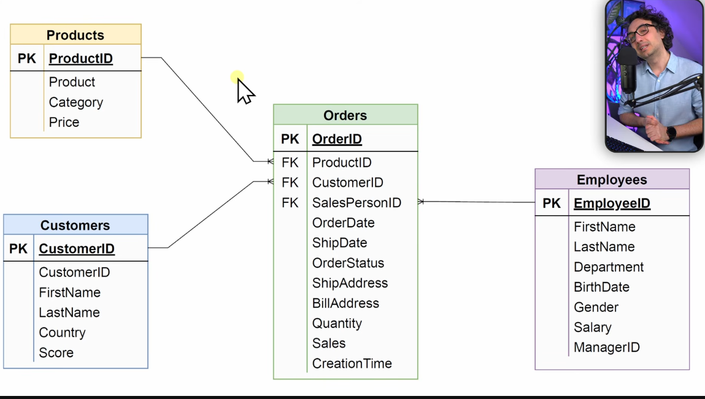

## Joins in sql 

- There can be 2 ways in which u can join tables either u wanna combine columns (joins) or u wanna combine row (set Operators)


## Joins

- lets say data is across 2 tables, u wanna query it and want data from 2 tables, so join the 2 tables based on a common column between 2 tables

- why do we even use joins ?

1) Recombine data :  customers , address, orders, reviews, etc

2) Data Enrichment (getting extra info) : customers , zip code tables (look up tables)

3) check for existence  of records from one table, whether they are present in other table or not !!


## Types of Joins :

LEFT TABLE : RIGHT TABLE

## 1) INNER JOIN :   middle part (matching rows from left and right table based on common column key)

```sql
Task : Get all customers along with their orders but only for customers who have placed an order 

SELECT *
from CUSTOMERS as c
INNER JOIN
ORDERS as o
ON c.cust_id = o.cust_id;

IMP : Table order doesnt matter in case of INNER JOIN !!

if the columns names are same between 2 tables they will be repeated in result table, therefore use alias !!


```
- use cases of INNER JOIN :

1) Recombine data :  customers , address, orders, reviews, etc

3) check for existence  of records from one table, whether they are present in other table or not !!


------------------------------------------------------------------------------------------------------


## 2) LEFT JOIN :

- returns all the rows from the left table and matching rows from right table (key matching)

- for all the rows in left table who have no matching records in right table, NULL will appear in columns of right table.

- Primary source is Left table and right table is secondary source

- the order of tables are imp, left one needs to be first and right one needs to be after join keyword

```sql
Task : Get all the customers along with their orders, including those without orders 

SELECT 
c.cust_id,
o.order_id,
c.name
FROM customers as c
LEFT JOIN orders as o
ON c.cust_id = o.cust_id;

```

- use cases of LEFT JOIN :

1) Recombine data :  customers , address, orders, reviews, etc

2) Data Enrichment (getting extra info) : customers , zip code tables (look up tables)

**LEFT + WHERE :**

3) check for existence  of records from one table, whether they are present in other table or not !!


---------------------------------------------------------------------------------------

## 3) RIGHT JOIN :

- returns all the rows from right table and matching rows from left

- just switch the table order in LEFT JOIN u will get right join !!! 


----------------------------------------------------------------------------------------

## 4) Full join :

- Returns all the rows from LEFT and RIGHT Table, nulls where no matching happend in common columns

- order of the table not imp

```sql
Task : get all customers and all orders even if there is no match 

SELECT *               --> u can include the cols u wanna show
FROM customers
FULL JOIN orders
ON c.cust_id = o.cust_id;

```

- use cases of Full join :
1) Recombine data :  customers , address, orders, reviews, etc

- Full Join + WHERE

3) check for existence  of records from one table, whether they are present in other table or not !!


============================================================================================

## Advanced joins :


### 1) LEFT ANTI-JOIN : 



```sql
Task : Get all the customers who havent placed any order 

SELECT *
FROM customers as c
LEFT JOIN orders as o
ON c.sudt_id = o.cust_id
WHERE o.cust_id IS NULL

logic : when u club 2 tables, the not common from left have null in the right table column , so the common column has null as well, in WHERE e check if that right table common col key is null , we are selecting such rows, which are only present in LEFT TABLE !!

```

- use case of LEFT ANTI JOIN :

3) check for existence of records from one table, whether they are present in other table or not !!


---------------------------------------------------------------------------------------------------------------------

### 2) RIGHT ANTI-JOIN :

- Return rows from right that has No match in Left

- use the LEFT ANTI JOIN ONLY, just switch the order of tables 


```sql
Task : Get all the orders without matching customers

SELECT *
FROM customers as c
RIGHT JOIN orders as o
ON c.cust_id = o.cust_id
WHERE c.cust_id IS NULL;


---> solving the above task using LEFT ANTI JOIN

SELECT * 
FROM orders as o
LEFT JOIN customers as c
ON o.cust_id = c.cust_id
WHERE c.cust_id IS NULL


```

- use case of RIGHT ANTI JOIN are SAME as LEFT ANTI join


--------------------------------------------------------------------------------------------------------------------


### 3) FULL ANTI JOIN :

- apart from common middle part of venn dig we want everything

- Retruns only rows that dont match in either Table

- opposite on inner join


```sql
Task : Find customers without order and orders without customers

SELECT *
FROM customers as c
FULL JOIN orders as o
ON c.cust_id = o.cust_id
WHERE c.cust_id IS NULL OR o.cust_id IS NULL;

same visualization logic as left join : form joined table and see what records u want where condition asks for nulls 


```

- use case of FULL ANTI JOIN :

3) check for existence of records from one table, whether they are present in other table or not !!


--------------------------------------------------------------------------------------------------

#### challenge :


```sql
Task : GET all customers along with their orders , but only customers who have placed their order (dont use inner join)

SELECT *
FROM customers as c
LEFT JOIN orders as o
ON c.cust_id = o.cust_id
WHERE o.cust_id IS NOT NULL;

```


-----------------------------------------------------------------------------------------------------------

## CROSS JOIN (cartesian product) :

- combine every row from left table to every row in right table, all combinations 

- left table 2 rows : 3 rows in right table  , total rows = 6

```sql
syntax :
SELECT *
FROM A
CROSS JOIN B

no need to mention condition of matching and all, we dont care about matching and all, as we want all possible combos 

Task : Generate all possible combos of cuasatomers and orders

SELECT *
from customers
cross join orders;


```


#### USE THE BELOW DECISION TREE WHILE CHOOSING WHICH JOIN TO USE IN QUERY 





---------------------------------------------------------------------------------------------------------------

## MULTI TABLE JOINS :

- using left join, u can achieve matching and even not matching data cases using WHERE condition





```sql

IF THERE IS ONE MAIN / MASTER TABLE AND REST ARE ADDITIONAL INFO TABLES :

SELECT *
FROM A      --? master table
LEFT JOIN B ON ..
LEFT JOIN C ON ..
LEFT JOIN D ON ..
WHERE --> CONTROLS WHAT TO KEEP 

IF ALL THE TABLES ARE EQUALLY IMP AND U WANT COMMON DATA :

SELECT *
FROM A
INNER JOIN B ON ..
INNER JOIN C ON ..

TASK : RETRIEVE A LIST OF ALL ORDERS ALONG WITH THE RELATED CUSTOMERS, PRODUCTS, AND EMPLOYEE DETAILS
       FOR EACH ORDER DISPLAY FOLLOWING COLUMNS 

TABLES INVOLVED : ORDERS (MASTER), CUSTOMERS, PRODUCTS , EMPLOYEE DETAILS

SELECT 
    o.ORDERID,
    o.SALES,
    c.FIRSTNAME as cust_fname,
    c.LASTNAME as cust_lname,
    p.PRODUCT,
    p.PRICE,
    e.FIRSTNAME as sales_emp_fname,
    e.LASTNAME as sales_emp_lname
FROM ORDERS as o
LEFT JOIN CUSTOMERS as c
ON o.cust_id = c.cust_id
LEFT JOIN PRODUCTS as p
ON o.prod_id = p.prod_id
LEFT JOIN EMPLOYEE as e
ON o.sales_person_id = e.emp_id   --> then name of columns can be different in table, but their meaning is same 


all the left joins in above are happening wrt to master table which is ORDERS , u can join with intermediate table as well , really depends on u though !!


```


u can join the tabels in any way u want, just think rationally !!!


