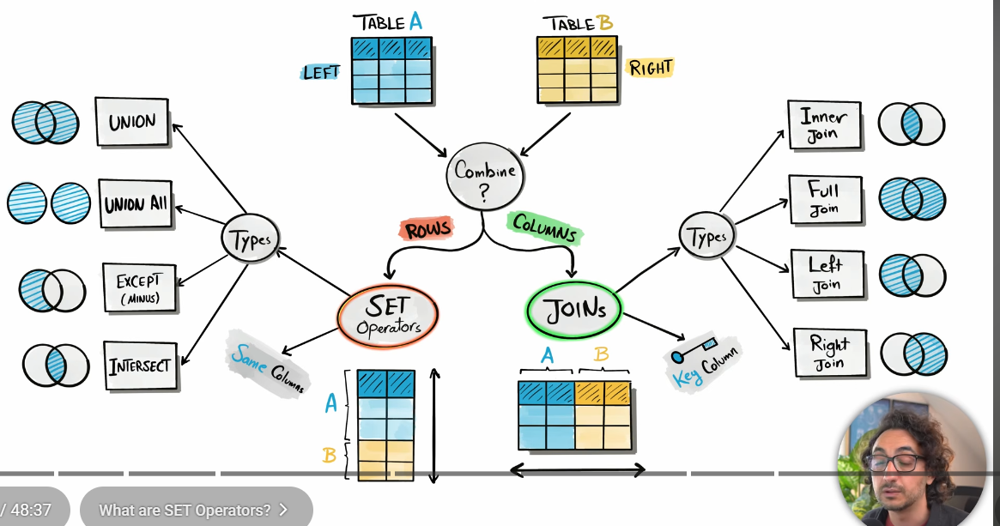
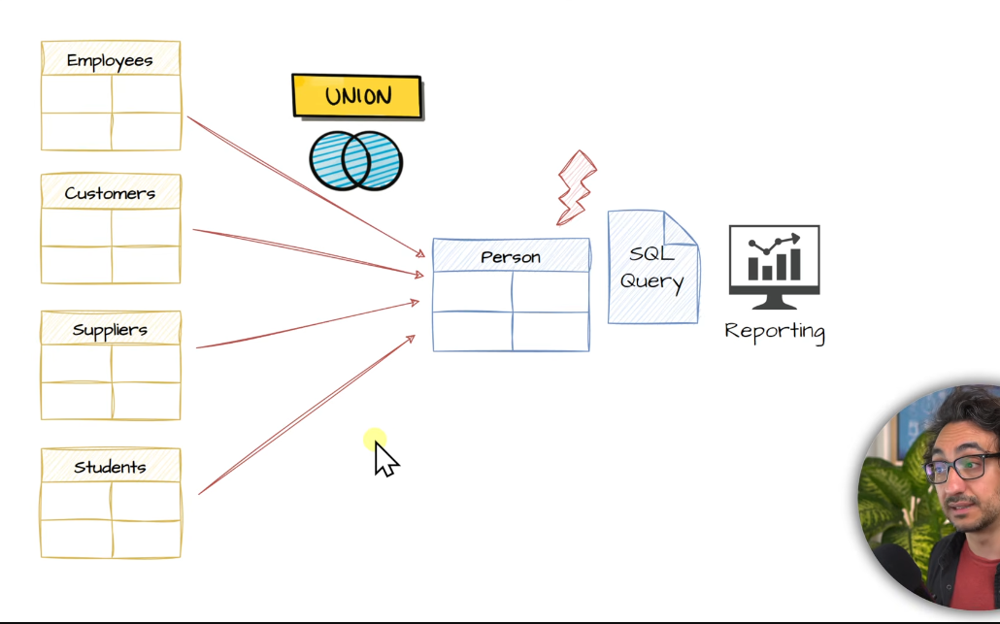
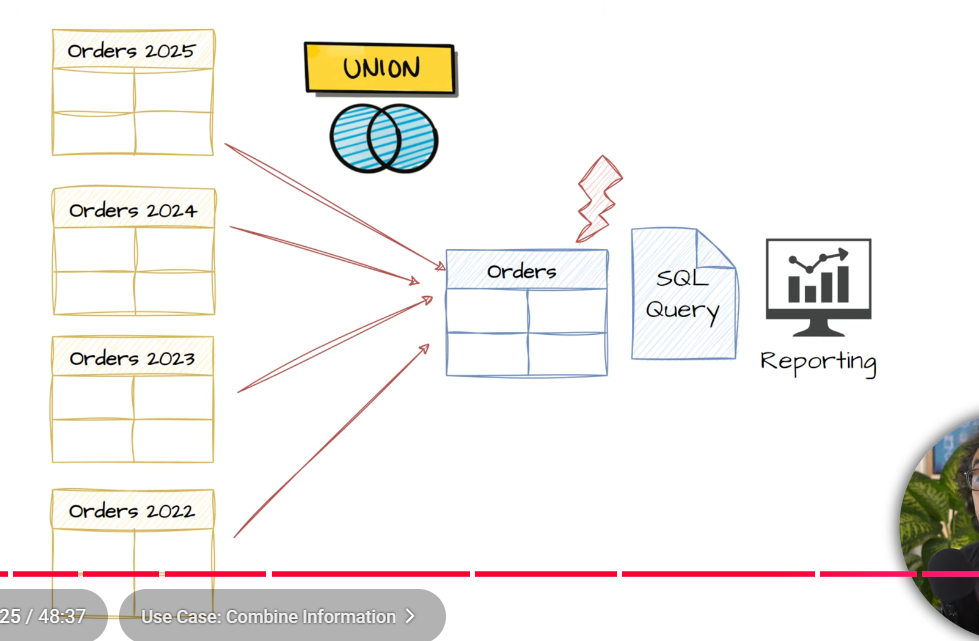

### SET VS JOINS :



- syntax for set operators :

```sql

select ...
from ...
where ....

UNION / UNION ALL / INTERSECT / EXCEPT

select ..
from ..
where ..

```

### RULE 1: sql clauses
- write 2 or more sql queries as u wish , use any clause u want, but in the end of entire query only u can use ORDER BY clause !!

### RULE 2: no. of cols and datatype of col
- no. of cols in each query must be same and the data types of each col must match

### RULE 3: order of cols
- order of cols in each query must be same , think in terms of datatype int , varchar :: int , varchar and not int , varchar :: varchar , int

### RULE 4: column names in o/p
- the first select query name column names are in the o/p of final o./p, if u wanna put aliases put it on first select query only !!

### RULE 5: SEMANTISM 
- its ur responsibilty to make things work, sql doesnt understanding semantics so it wont through error


------------------------------------------------------------------------------------------------------

### 1) UNION operator :  

- outputs all unique rows from both the tables, whatever the columns u have selected in SELECT clause , the unique combos of those will appear in final output !!

- the common rows between both table (of course the entire row combo needs to be unique) will be shown only once

- if there are duplicate rows in a single table, even that are removed !!

```sql

Task : combine data from employees and customers table

SELECT NAME, LASTNAME
FROM CUSTOMERS
UNION 
SELECT EMP_NAME, EMP_LASTNAME
FROM EMPLOYEES;

```


---------------------------------------------------------------------------------------------------------


### 2) UNION ALL :  () ()

- returns all the rows , does not remove duplicates, as it is rows are shown 

- when to use UNION ALL compared to union ?
  - union all has better performance than union as its not removing duplicates so no duplication check needed, so if u know the data u are querying is all unique, use union all
  - data quality checks


```sql

SELECT NAME, LASTNAME
FROM CUSTOMERS
UNION 
SELECT EMP_NAME, EMP_LASTNAME
FROM EMPLOYEES;

```


-----------------------------------------------------------------------------------------------------------


### 3) EXCEPT (MINUS) :

- returns all distinct rows from first query that are not found in the second query i.e common rows b/w both table will be removed
- order of query matters 
- removes duplicates from result set 


```sql
Task : find employees who are not customers

SELECT name, lastname
from empolyees
EXCEPT
select cust_name, lname
from customers;


```

--------------------------------------------------------------------------------------------------------


### 4) INTERSECT :

- returns rows that are common in both queries
- removes duplicates

```sql
Task : find the employees who are also customers

SELECT name,lastname
from employees
INTERSECT
Select cust_name, lname
from customers;

```


-------------------------------------------------------------------------------------------------------------


## USECASES :

### 1) Combine information (union and union-all)




- after the rows are clubbed then analytical sql queries can be performed on it 


```sql
Task : orders are stored in ORDERS AND ORDER-ARCHIVE tables
       combine all orders into one report without duplicates 
       all the col and datatype and order are same

SELECT 
'orders' as SourceTable,              --> in SourceTable in front of rows from orders table we will see orders text and 
                                      --> same for rows of orderarchive we will see ordersarchive , helps to know where 
                                      --> the row came from if the columns are consfusing u 
*
from orders                      
UNION
SELECT 
'ordersarchive' as SourceTable,
*
FROM ordersarchive; 


```


-------------------------------------------------------------------------------------------------------

### 2) Delta Detection (Except) :

- identifying difference or changes (delta) between 2 batches of data

- source table got updates, except the current state from previous state 

--------------------------------------------------------------------------------------------------------


### 3) Data Completenees check (Except) :

- lets say in migration project u move 1 table from db a to db b , to ensure all the enteries are present do a - b
- here - means using EXCEPT
- if the o/p is empty it means all the rows in a are in b 


-------------------------------------------------------------------------------------------------------- 