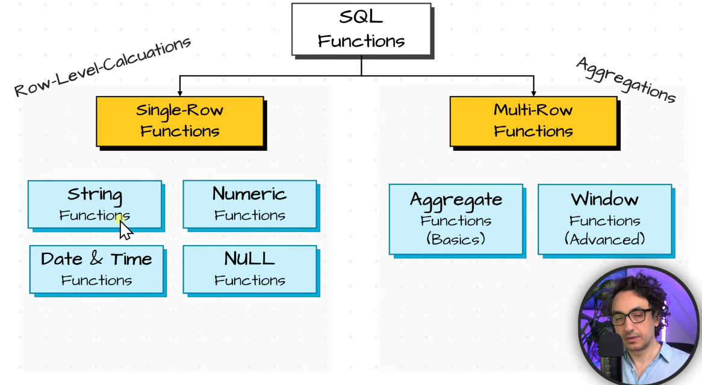

### Sql functions type :

- functions take an i/p , process and return rows

1) single row funtion :
take a single value and return a single value     lowers()

2) multi-row funtion :
take multiple values and return a single value     sum()

### Nested funtions :

LEN(LOWER(LEFT("Maria",2)))    executions start from inside to outside 

## Categorization of Functions in SQL :

- Single row function are imp for data engineers and multi-row functions for Data analysts

