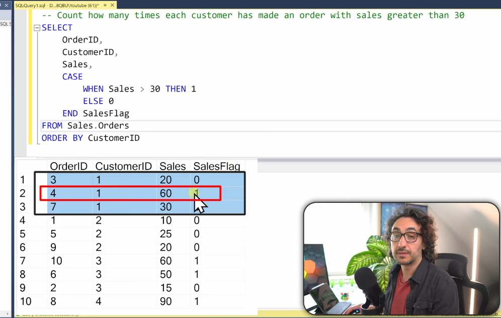

## Case statements

- Evaluates a list of conditions and returns a value when the first condition is met 

- syntax :

```sql

CASE 
    WHEN cond1 THEN result 1
    WHEN cond2 THEN result 2
    ...
    ELSE result          ---> if no condition is true then return this o/p (its optional btw)

END

```

- if any of the condition is evaluated as True, the below conditions wont be checked for that argument

### A single rule to follow :
- datatype after THEN and ELSE must be matching TYPE

- CASE STATEMENTS CAN BE USED IN ANY OF THE CLAUSE , SELECT , GROUP BY, HAVING , ORDER BY , JOIN ,ETC


## USE CASES :

Main purpose is to do data Transformation ( derive new col for analytics )

### 1) Categorizing Data :

- group data in categories based on some conditions 

```sql
Task : generate a report showing total sales per category 
       high if sales higher than 50
       medium if b/w 20 and 50
       low  if <=20

sort the result highest to lowest 

SELECT 
Category,
SUM(sales) as Total_sales
FROM (

SELECT 
    ORDERID,
    sales, 
    CASE
       WHEN sales > 50 THEN 'HIGH'
       WHEN sales > 20 THEN 'MEDIUM'
       ELSE 'LOW'
END AS CATEGORY
) t
GROUP BY Category
ORDER BY Total_sales;

--> Here we have used subquery, think of it like inner query executes first and forms a temporary table , and the outer query is being made on top of that inner temp table, so u can refer to inner tables columns and all in outer query

```

---------------------------------------------------------------------------------------------


### 2) MAPPING VALUES

```sql
Task : Retrieve employee details with gender displayed as full text 

select 
    emp_id,
    name,
    gender,
    CASE 
        WHEN gender = 'M' then 'male'
        WHEN gender = 'F' then 'female'
        ELSE 'Not Available'
    END gender_full
from employees;


```

---------------------------------------------------------------------------------------------


### short hand syntax of case when :

```sql 
CASE  Country                 --> only 1 col can be evealuated here 
WHEN 'germany' then 'de'
when 'india' then 'ind'
when 'australia' then 'aus'
END 

otherwise
WHEN country = 'germany' then 'de'
when country = 'india' then 'ind'
when country = 'australia' then 'aus'

```

--------------------------------------------------------------------------------------------

### 3) handling nulls :

- replace null with a specific value

```sql
Task : find avg scores of customers and treat nulls as 0 and additionally provide details such as cust_id and lastname

 
```


---------------------------------------------------------------------------------------------

### 4) conditional aggregation :

```sql

Task : count how many times each customer has made and order with sales greater than 30

```




```sql
ans:

SELECT 
    customer_id
    SUM(CASE 
        WHEN sales >30 then 1
        ELSE 0
        END) TOTAL_ORDERS,
    count(*) as in_total_order_count
from orders
group by customer_id;


```