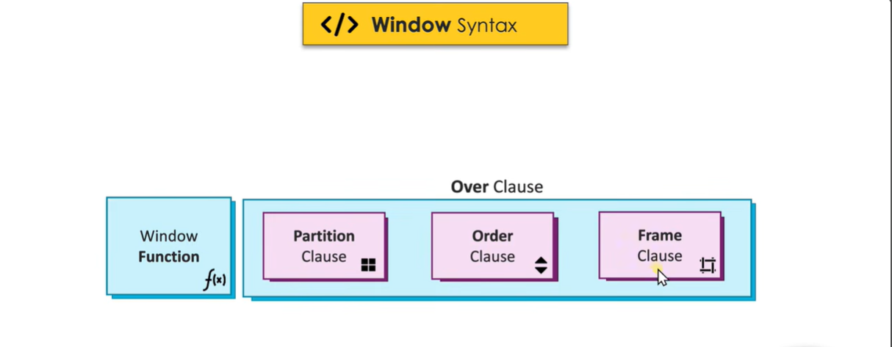

### What do window fucntions do ?

- perform aggregation on sub-set of data without lossing row level granularity **unlike GROUP BY** where we loose granularity


-----------------------------------------------------------------------------------------------------

- functions available in group by vs in window functions :


----------------------------------------------------------------------------------------------------

### Eg :

```sql
Task : Find the total sales for each product , additionally provide details such as order id and order date

if we simply use GROUP BY productid, orderid , orderdate, we wont be doing correc aggregations !! we wanna aggregate based on productId only but since GROUP BY statement does not allow (has restrictions of select cols and group by clause stuff and all) it wont work.

Window function returns a result for each row (Result Granularity)

SELECT 
    orderId,
    orderDate,
    ProductId,
    SUM(sales) OVER(PARTITION BY ProductId) as TotalSalesByProduct
From Orders;

partition by is just a way to tell " group by what " in window functions !!!!

```


### Syntax for window functions :




