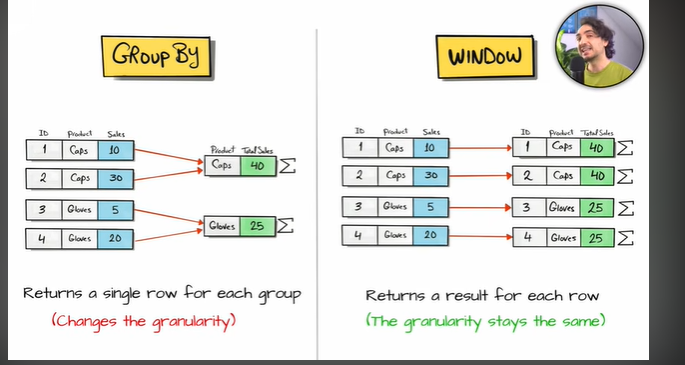
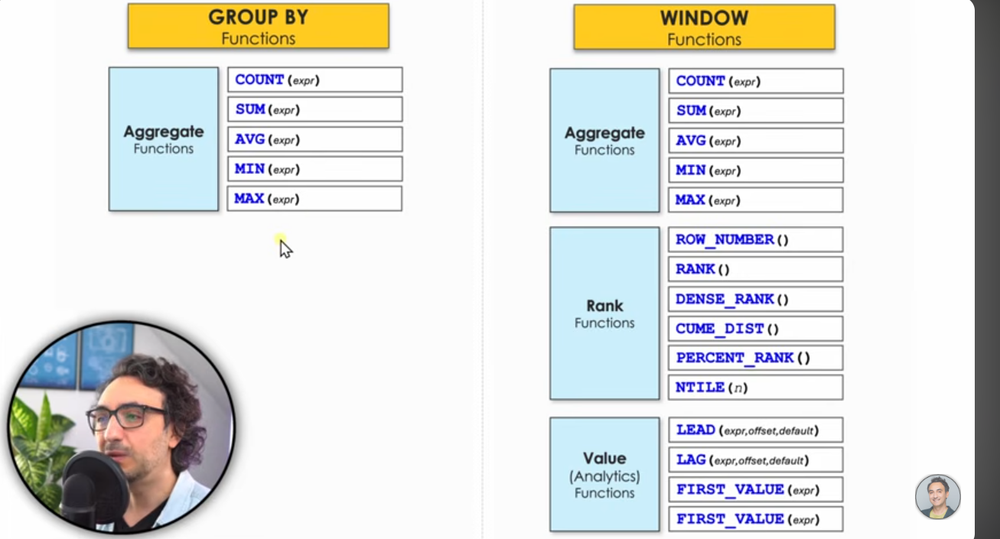

### What do window fucntions do ?

- perform aggregation on sub-set of data without lossing row level granularity unlike GROUP BY where we loose granularity

-----------------------------------------------------------------------------------------------------

- functions available in group by vs in window functions :

